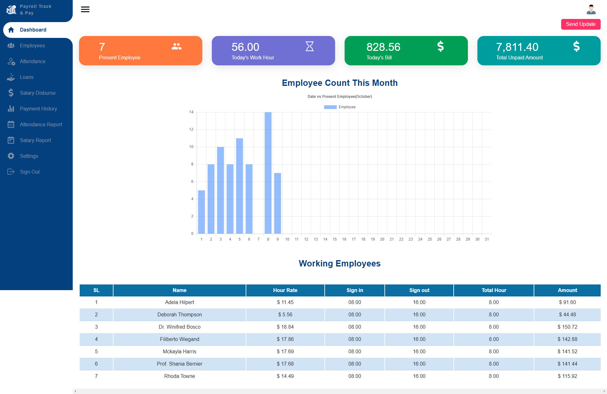
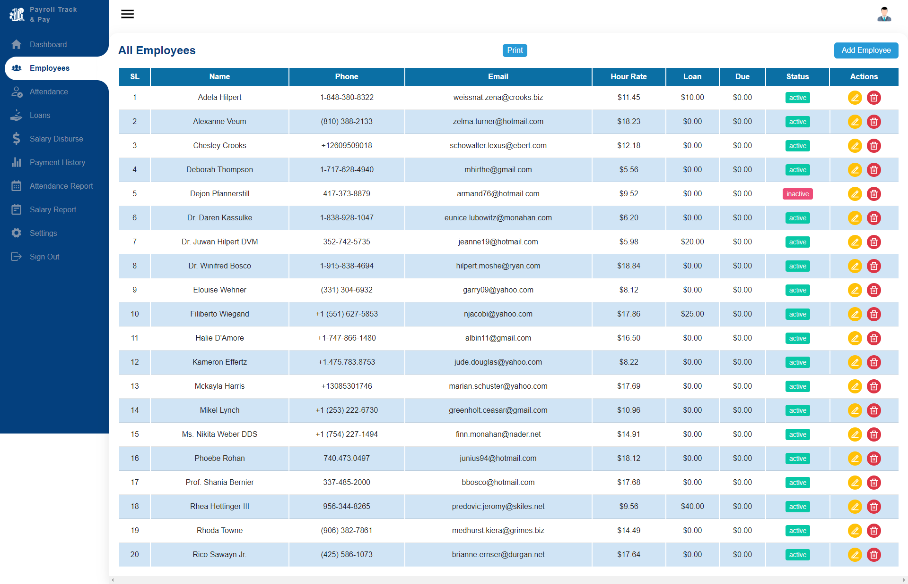
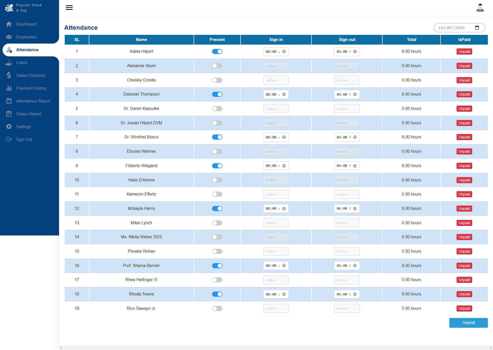
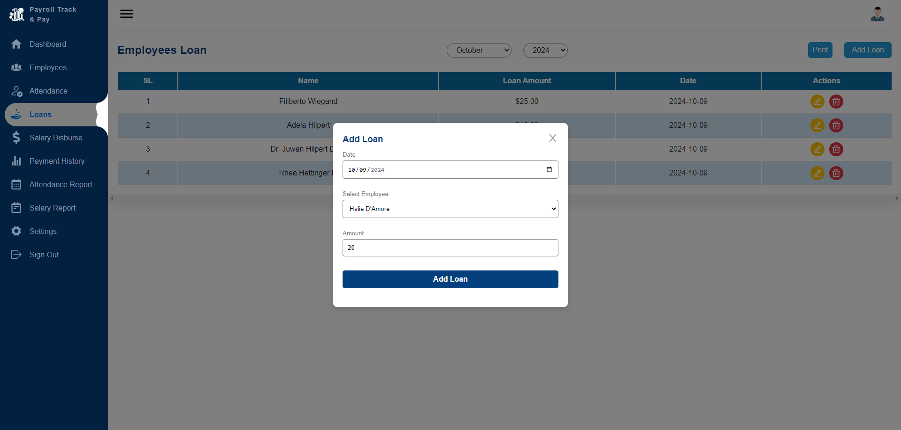
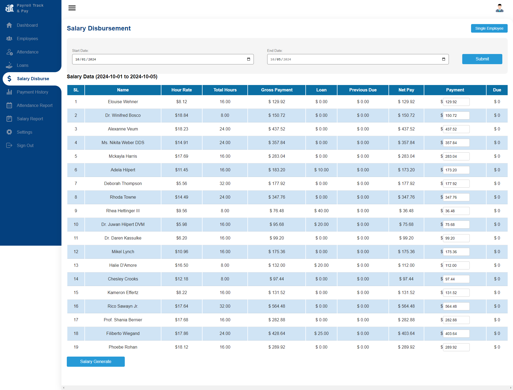
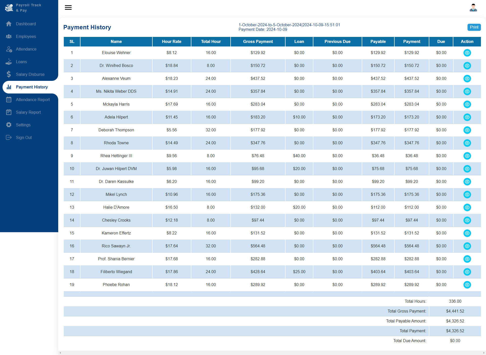
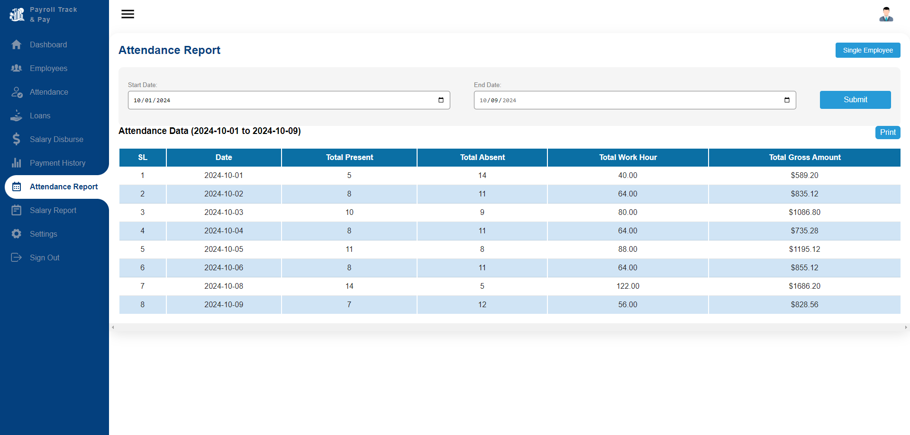
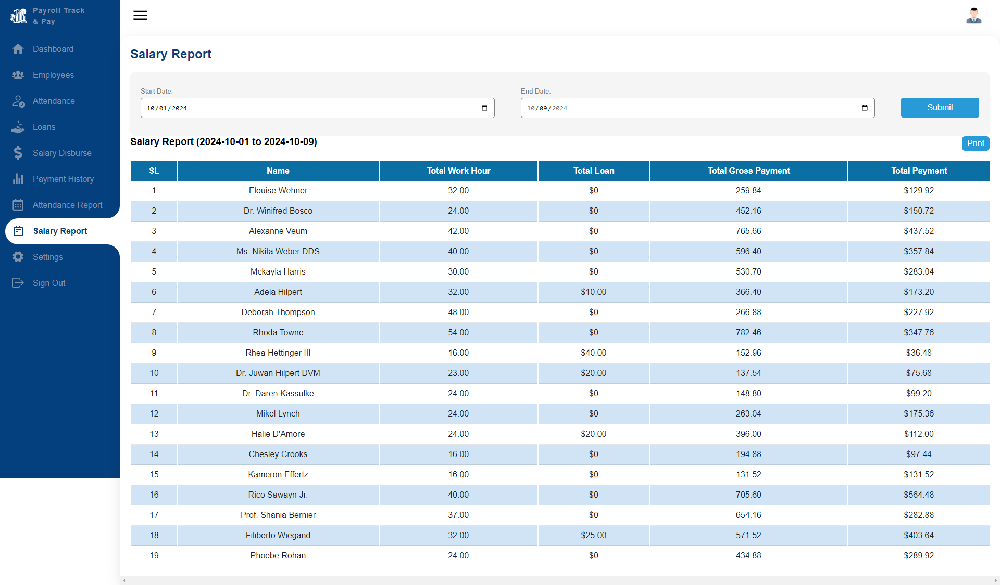
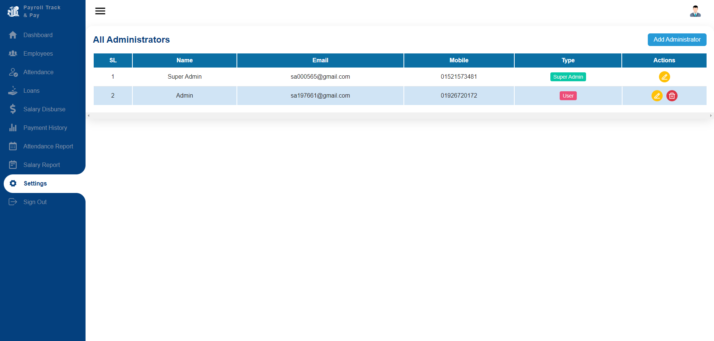

# Payroll Track & Pay

## Overview

Payroll Track & Pay is a comprehensive attendance and salary disbursement system designed to streamline employee management, payroll processing, and attendance tracking. This system provides administrators with powerful tools to manage employee data, attendance records, salary disbursement, and loan management efficiently.

## Technology Used

### Frontend

-   React
-   Redux Toolkit
-   Chart.js
-   react-to-print
-   Vite

### Backend

-   Laravel
-   Laravel Sanctum

## Features

### Dashboard

-   **Today's Present Employee Count**: Displays the number of employees present today.
-   **Today's Work Hours**: Shows the total work hours logged by employees today.
-   **Today's Bill**: Provides an overview of today's billing amount.
-   **Total Unpaid Salary**: Displays the total unpaid salary for all employees.
-   **Employee Count Graph**: Visual representation of employee count for the current month (1st to last date).
-   **Today's Working Employees Table**: Lists all employees who are working today.

    

### Employee Management

-   **CRUD Operations**: Create, read, update, and delete employee data.
-   **Employee Data Display**: Shows comprehensive details of all employees.

    

### Attendance Management

-   **Attendance Record**: Displays attendance records for all employees on a selected date.
-   **Edit Sign-In/Sign-Out Time**: Allows administrators to modify sign-in and sign-out times.

    

### Loan Management

-   **Loan History**: Shows the loan history for each employee.
-   **Loan Status**: Displays the status of loans (paid or unpaid).
-   **Loan Application**: Allows employees to apply for loans.

    

### Salary Disbursement

-   **Payroll Display**: Shows all employees' payroll details for a selected date range, including working hours, hourly rate, and loans.
-   **Edit Payment Details**: Administrators can edit payment amounts and manage due payments.
-   **Individual Employee Management**: Admin can switch to manage individual employee records.

    

### Payment History

-   **Payment Records**: Displays all payment history created by the owner.
-   **Transaction Details**: Provides detailed information about single payment transactions.

    

### Attendance Report

-   **Attendance Overview**: Shows attendance records for a selected date range, including total presents, absents, work hours, and gross amount.
-   **Individual Employee Switching**: Admin can switch to view individual employee attendance details.

    

### Salary Report

-   **Salary Overview**: Displays all employee work hours, total loans, and total payments for a selected date range.

    

### Settings

-   **Administrator Management**: Shows all administrators with roles (Super Admin or User).
-   **Create, Edit, Delete Admins**: Allows the creation, editing, and deletion of administrator accounts.

    

### Project Structure

-   **Frontend**: [View Frontend Code](https://github.com/shaakilahammed/payroll-track-pay/tree/main/react-frontend)
-   **Backend**: [View Backend Code](https://github.com/shaakilahammed/payroll-track-pay/tree/main/laravel-backend)

### Contributing

Contributions are welcome! Please open an issue or submit a pull request for any improvements or bug fixes.
